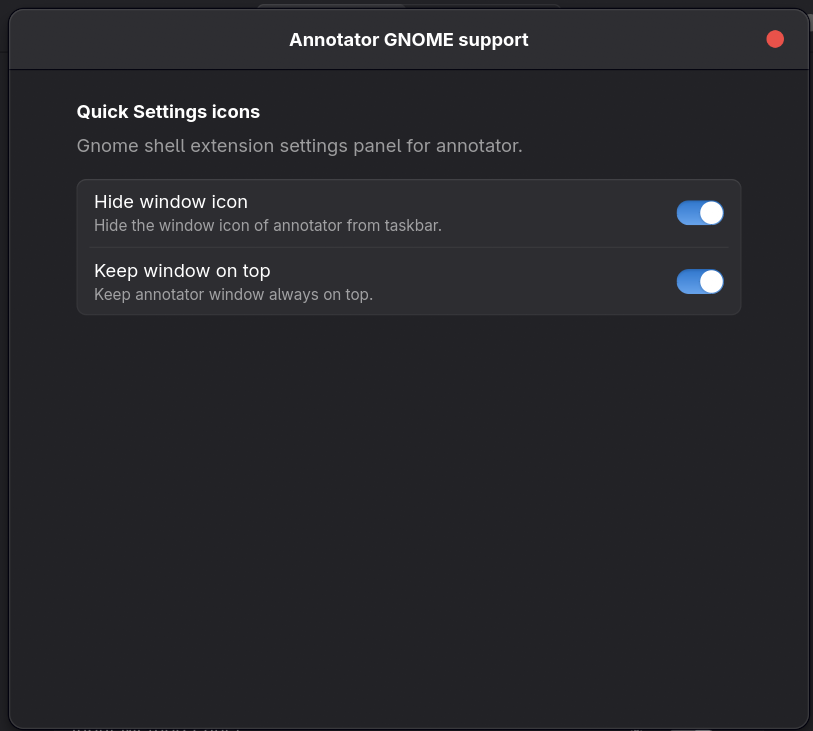

# Annotator gnome extension (GNOME Extension)

Hide specific system icons from the GNOME Quick Settings panel.



## Install

## Manual installation (from source)

Prerequisites:
- make, zip, glib-compile-schemas
- Node.js and npm

```bash
npm install

make pack

# Install the build (45–49) to ~/.local/share/gnome-shell/extensions
make install
```
